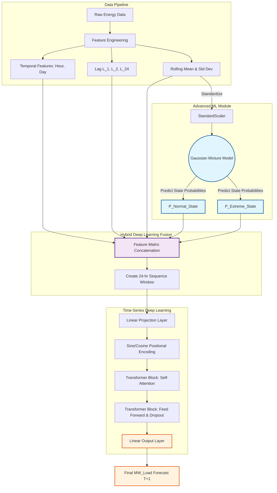

# Hybrid Temporal Forecaster Architecture

This diagram visualizes the data flow required for **Model C (The Hybrid Forecaster)**, answering the rubric criteria: *"A high-level visual showing the data flow between the probabilistic model and the neural network."*

### Explanation of the Hybrid Data Flow
1. **Classical Feature Extraction:** Standard rolling constraints map the temporal dependencies.
2. **Probabilistic Interpretation:** A `Gaussian Mixture Model` isolates exactly what "regime" the dataset is currently experiencing (e.g. Normal Grid Operation vs Summer Heatwave). It outputs explicit probabilities, entirely decoding the "black box" nature of standard Deep Learning distributions.
3. **Neural Representation Learning:** The Transformer encoder receives these probabilistic mappings as external "hints," alongside the raw positional embeddings. Its *Multi-Head Self-Attention Mechanism* then learns to shift its internal interpolation weights (e.g., relying strictly on `lag_24` during normal states, but focusing exclusively on `lag_1` during extreme state heatwaves).
