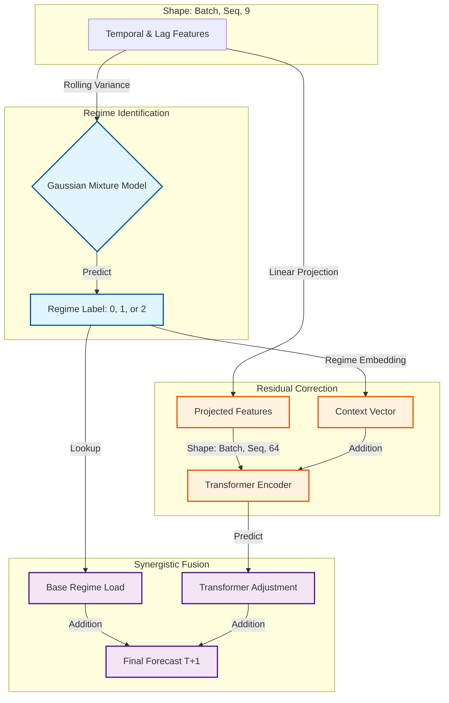

# Phase 3: Synergistic Hybrid Architecture

This diagram visualizes the **Synergistic interaction** between the ML and DL components, specifically designed for the Phase 3 rubric (Level 5).

```mermaid
flowchart TD
    subgraph Input Data [Shape: Batch, Seq, 9]
        Raw[Temporal & Lag Features]
    end

    subgraph ML Intelligence: GMM [Regime Identification]
        Raw -->|Rolling Variance| GMM{Gaussian Mixture Model}
        GMM -->|Predict| R[Regime Label: 0, 1, or 2]
    end

    subgraph DL Engine: Transformer [Residual Correction]
        Raw -->|Linear Projection| Proj[Projected Features]
        Proj -->|Shape: Batch, Seq, 64| TEncoder[Transformer Encoder]
        R -->|Regime Embedding| Emb[Context Vector]
        Emb -->|Addition| TEncoder
    end

    subgraph Synergistic Fusion
        R -->|Lookup| Base[Base Regime Load]
        TEncoder -->|Predict| Adj[Transformer Adjustment]
        Base -->|Addition| Final[Final Forecast T+1]
        Adj -->|Addition| Final
    end

    %% Styles for Rubric Level 5
    classDef ml fill:#e1f5fe,stroke:#01579b,stroke-width:2px;
    classDef dl fill:#fff3e0,stroke:#e65100,stroke-width:2px;
    classDef fusion fill:#f3e5f5,stroke:#4a148c,stroke-width:2px;

    class GMM,R ml;
    class TEncoder,Emb,Proj dl;
    class Base,Adj,Final fusion;
```

### 💡 Why this is "Synergistic" (Rubric Level 5)
1. **Model A (ML)** handles the **static distribution**: It identifies the "Regime" and provides a stable base-load estimate.
2. **Model B (DL)** handles the **dynamic sequence**: It calculates the "Residual" (the fine-grained correction) by looking at high-frequency temporal patterns.
3. **The Synergy**: The whole is greater than the sum because the Transformer no longer has to "re-learn" the basic load levels of different regimes; it only focuses on correcting the errors of the ML model.

### 📊 Tensor Flow Details
- **Input**: `(Batch, 24, 9)`
- **GMM Output**: `(Batch, 1)` Discrete Labels
- **Regime Embedding**: `(Batch, 1, 64)` Added to Transformer sequence.
- **Fusion Point**: `Base_Load[Regime] + Transformer_Residual(x)`

